&nbsp;&nbsp;&nbsp;&nbsp;

# Azure Foundry - Chatbot

Chatbot baseado em conteúdos de arquivos PDF utilizando o Azure Foundry


O documento a seguir descreve o processo de criação de um chatbot utilizando a plataforma **Azure Foundry**, desde a configuração dos componentes necessários, para aplicação e treinamento do modelo, bem como demonstração de uso e aplicação do modelo na prática. 

## Índice

- [1. Workspace e Recursos](#1-workspace-e-recursos)
  - [1.1 Sobre Recursos utilizados](#11-recursos-utilizados)
  - [1.2 Configuração do Azure AI Search](#12-azure-ai-search)
  - [1.3 Configuração do Azure AI Foundry](#13-azure-ai-foundry)
- [2. Azure AI Foundry Studio](#2-azure-ai-foundry-studio)
  - [2.1 Criando um novo Projeto](#21-criação-do-projeto)
  - [2.2 Criando um agente](#22-criando--agente)
  - [2.3 Implantação de Modelos e Configuração da Solução ](#23-implantação-de-modelos-e-configuração-da-solução)
    - [2.3.1 Configurando o Chatbot](#231-configurando-o-chatbot)    
    - [2.3.2 Adicionando os Dados](#232-adicionando-os-dados)    
    - [2.3.3 Definindo o Contexto](#233-definindo-o-contexto)    
    - [2.3.4 Exemplos de Conversação](#234-exemplos-de-conversação)   
- [3. Avaliando o modelo](#3-avaliando-o-modelo)
    - [3.1 Avaliando Manualmente](#31-avaliação-manual)    
    - [3.2 Avaliando De forma Automatizada](#32-avaliação-automatizada)    
- [4. Conclusão](#4-conclusão)


## 1. Workspace e Recursos

**Para o início do projeto, foi criada uma workspace nomeada como `proj-02-Dio`:**

Para evitar problemas com "recursos indisponíveis", tanto o workspace quanto os demais recursos foram provisionados com a localidade **East US**.
Obs.: Durante a configuração do projeto, foi identificado que o modelo de linguagem GPT-4o não possuía cotas disponíveis para implantação como Global Standard, então foi adotada a implementação de outro modelo disponível, e visando a celeridade de processamento do processo foi selecionado a localidade mencionada.

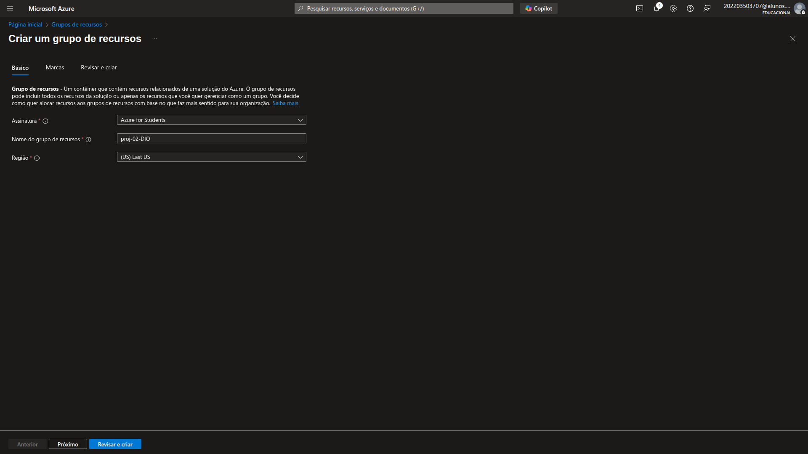 
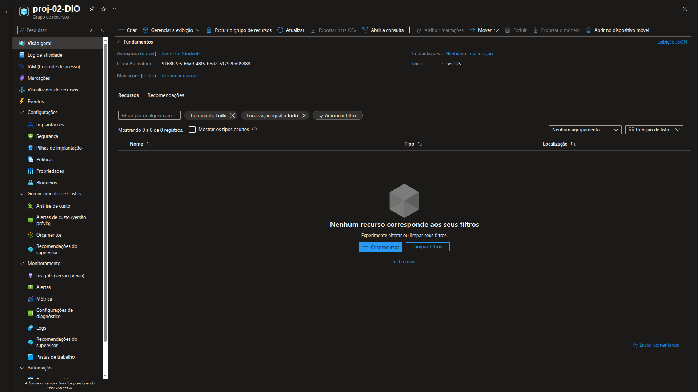  

---

### 1.1 Recursos-Utilizados

Antes de iniciar a criação do projeto de chatbot que será utilizado posteriormente, é necessário que os recursos complementares estejam devidamente criados e prontos para uso no workspace.  

Além do recurso principal **Azure AI Foundry**, é essencial que o serviço **Azure AI Search** também esteja presente no workspace criado, pois é por meio dele que será possível configurar o modelo utilizado, permitindo que este busque os arquivos fornecidos e os converta em uma base de conhecimento para o agente.  

Sendo assim, foram criados os seguintes recursos:


---

### 1.2 Azure AI Search

Para que o chatbot a ser criado tenha um viés baseado nos documentos fornecidos, é necessário criar o recurso **[Azure AI Search](#azure-ai-search)**.Após selecionar o tipo de modelo a ser implantado, será apresentada a tela para seleção dos modelos de agente disponíveis.  
 
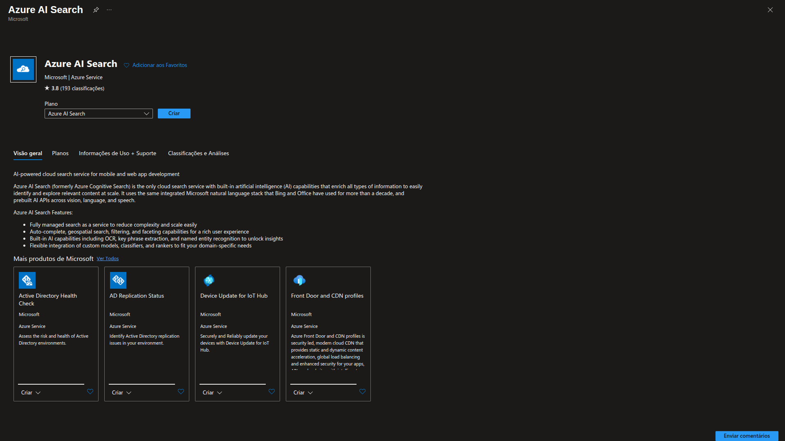  

As seguintes especificações foram utilizadas na criação do recurso:

#### Informações do Serviço Azure AI Search

| **Configurações Básicas**     |                          |                                                                 |
|-------------------------------|--------------------------|-----------------------------------------------------------------|
| **Nome do Serviço**           | **Localização**          | **Tipo de Serviço**                                             |
| `proj-2-azureaisearch-dio`    |  East US                 | Básico (15 GB/partição, máx. 3 réplicas, máx. 3 partições, até 9 unidades de pesquisa) |

|                               | **Escala**               |                                                                 |
|-------------------------------|--------------------------|-----------------------------------------------------------------|
| **Unidades de Pesquisa**      | **Custo Estimado por Mês** | **Réplicas e Partições**                                        |
| 2/9                           | US$ 150,29               | 2 réplicas e 1 partição                                         |

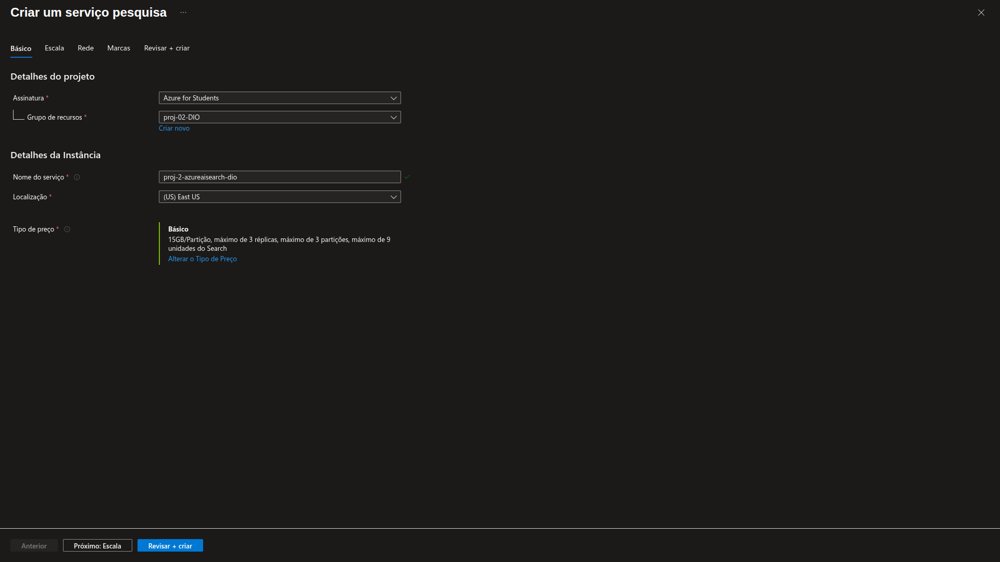
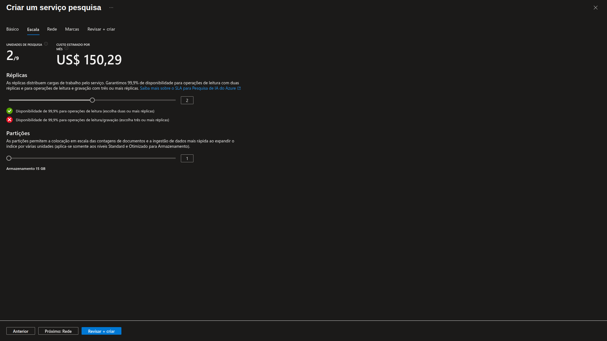  

As configurações de rede e marcas do serviço foram mantidas como padrão.  
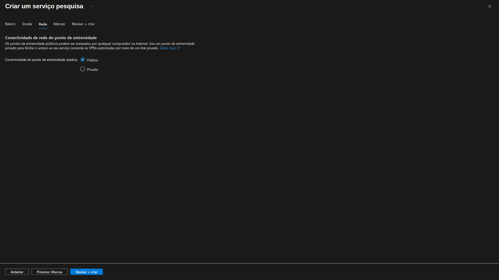  

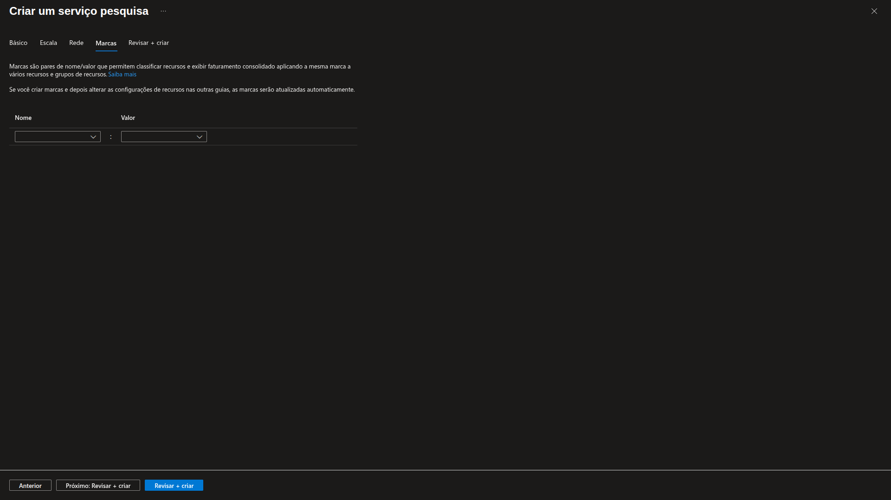  

Com as configurações devidamente realizadas, o serviço foi criado e integrado ao workspace.  
  

---

### 1.3 Azure AI Foundry

Com o serviço **Azure AI Search** instalado e configurado, foi realizada a implantação do serviço **Azure AI Foundry**.  

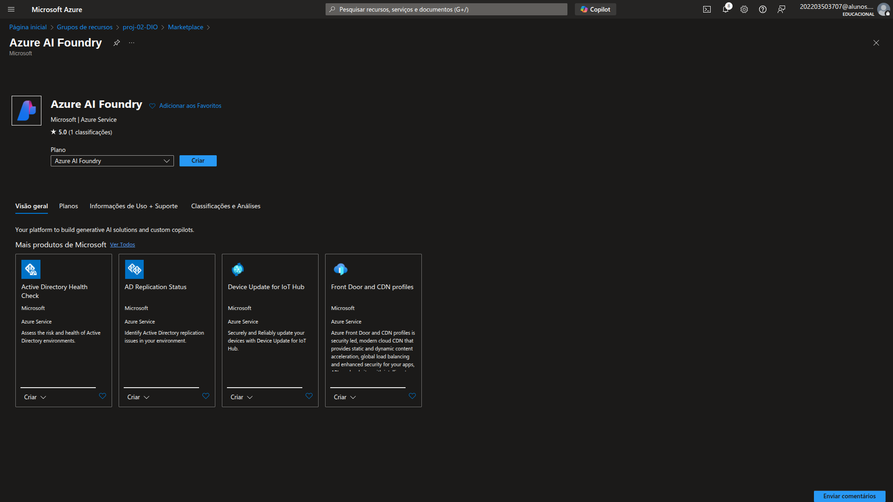  

---  

Ao iniciar a criação do serviço, a plataforma direciona automaticamente para a criação de um **HUB**, responsável por armazenar os projetos que serão desenvolvidos futuramente.

As seguintes especificações foram utilizadas:

#### Informações do Serviço Azure AI Foundry

| **Configurações Básicas**      |            |                 |
|--------------------------------|------------|-----------------|
| **Nome do Serviço**            | **Localização** | **Grupo de Recursos** |
| `proj-2-azureaifoundry-dio`    | East US    | proj-02-dio     |

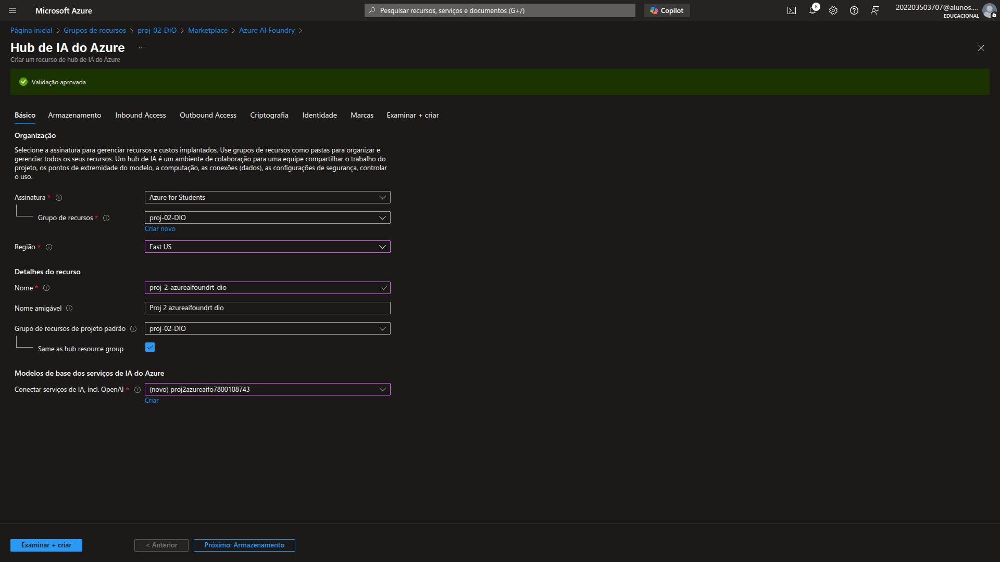  

As demais configurações foram mantidas com os valores padrão.  
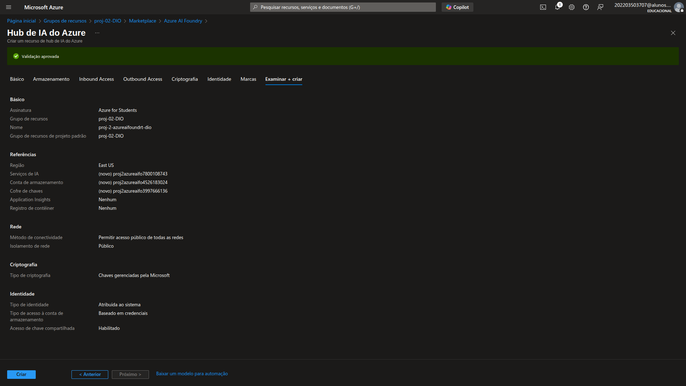  

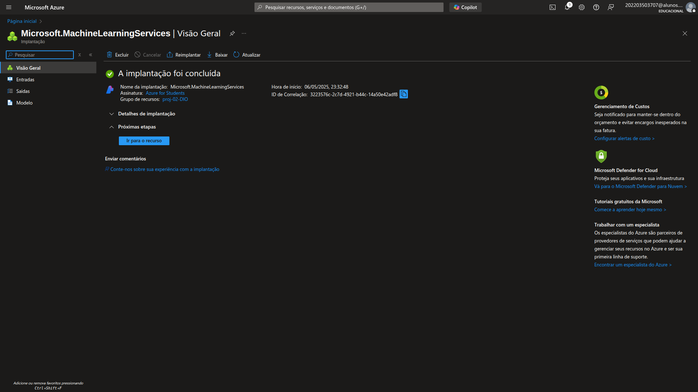  

Com os recursos primários devidamente implantados, dá-se início ao processo de criação e treinamento do chatbot.

## 2 Azure AI Foundry Studio
Dentro do ambiente do **Azure AI Foundry**, é apresentada a tela de Overview, na qual são exibidos todos os projetos criados para aquele hub.
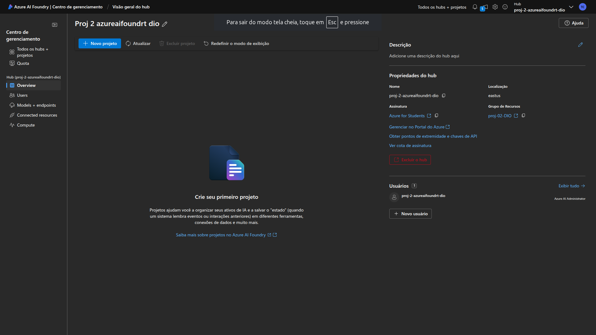  
Nesse menu, é possível não apenas criar um novo projeto para o hub, como também visualizar todos os projetos já existentes. O projeto que será estudado foi nomeado como **"tcchat"**.
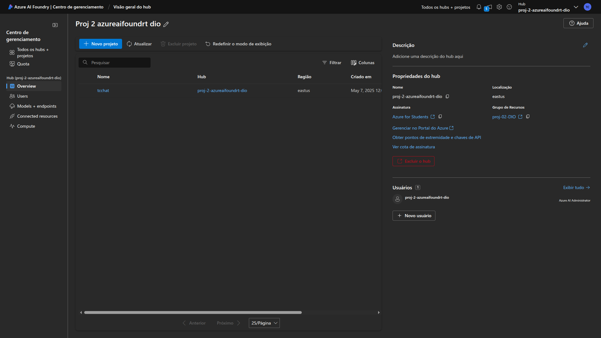  

### 2.1 Criação do projeto
Dentro desse menu de Overview, ao clicar na opção de "Novo Projeto", será apresentada uma tela para nomear o novo projeto a ser desenvolvido.
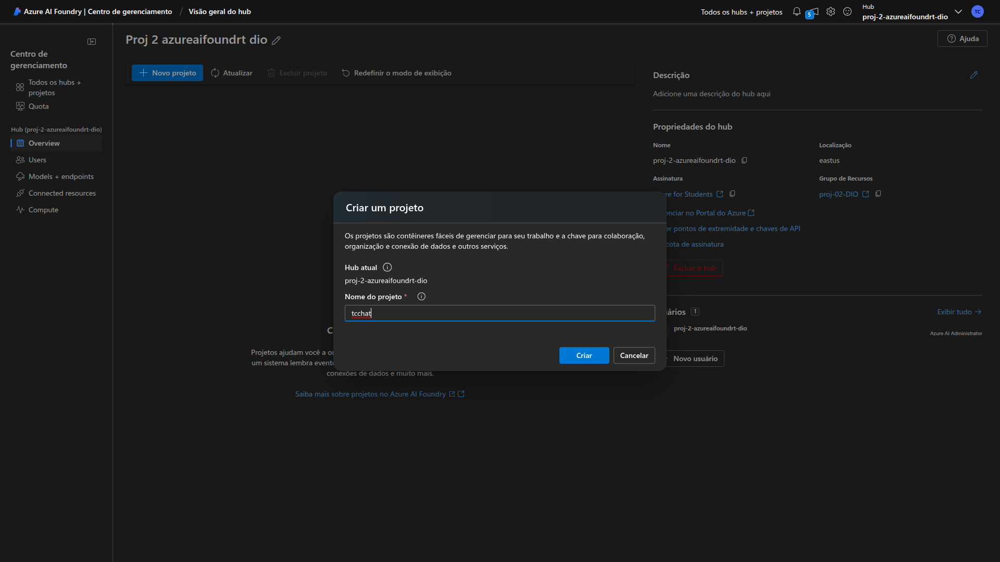  
Após a criação, o usuário é direcionado ao centro de gerenciamento do projeto, onde será feita a configuração propriamente dita. Nessa mesma tela, já é possível visualizar, além dos endpoints disponíveis, quais são os recursos conectados ao projeto.  

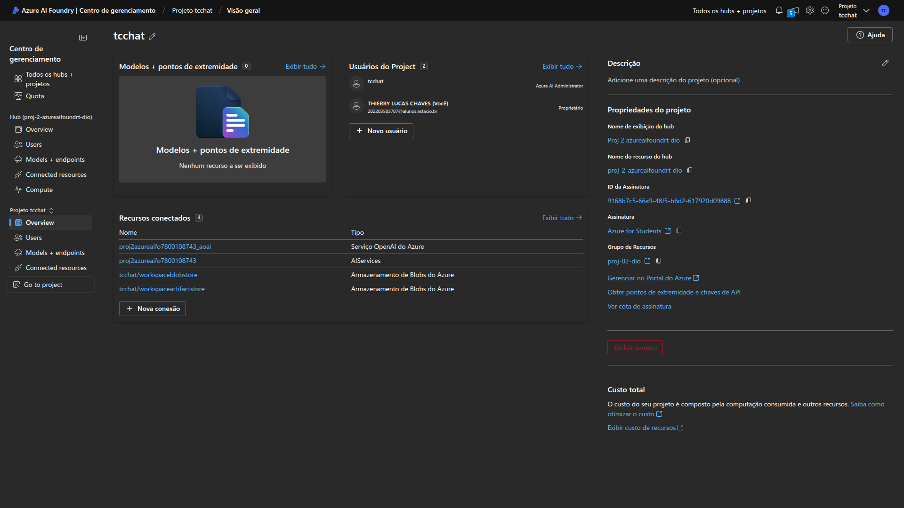

--- 
### 2.2 Criando o agente
Para criar um novo agente para o projeto, devemos acessar a opção de "Models + Endpoints" correspondentes ao projeto desejado.
#### Criando um novo modelo 
Dentro da opção "Models + Endpoints", são apresentados todos os modelos já implantados, bem como os pontos de acesso daquele projeto. Também é apresentada a opção de criar um novo modelo, onde é possível selecionar se o novo modelo a ser criado será um modelo básico ou um modelo ajustado.  

    (Para o projeto em questão, será criado apenas um modelo básico.)

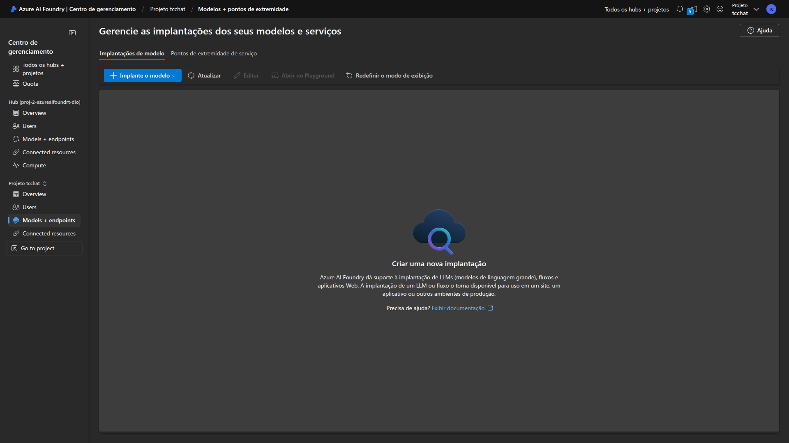

  

### 2.3 Implantação de Modelos e Configuração da Solução  
A seguir, descrevem-se as etapas de implantação dos modelos de linguagem, adição dos dados, configuração do ambiente de chat e definição do contexto necessário para o funcionamento do assistente inteligente baseado em IA.
 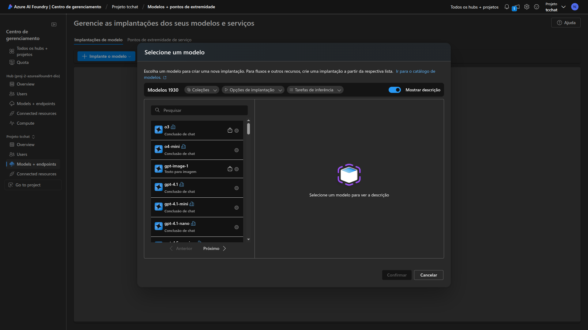  

**Observação**: Durante a implantação do modelo, é importante atentar-se à quantidade de cotas disponíveis. Essa informação pode ser consultada na opção **QUOTA**.  
  

Neste projeto, foram utilizados dois modelos de linguagem para a criação do chatbot:  

- `gpt-4o-mini`
- `text-embedding-3-large`

Com os modelos criados e disponíveis para uso no projeto, foi possível iniciar o processo de configuração do chatbot. A partir do acesso ao projeto no Azure AI Foundry, deve-se navegar até o menu **"Playground"** para dar início à configuração do modelo de chat.
 


### 2.3.1 Configurando o Chatbot

Na área de **Playground**, é possível acessar a seção de configuração do chatbot. Nessa etapa, são definidos:

- O comportamento do chat,
- A base de conhecimento a ser utilizada,
- Os testes iniciais com o modelo.


Antes de realizar a engenharia de prompt, é necessário definir a base de dados (PDFs) que será utilizada como fonte para as respostas do chatbot. Essa base irá guiar a pesquisa e o contexto das respostas, formando uma base de conhecimento enviesada e especializada.

---

### 2.3.2 Adicionando os Dados

Selecionando a opção **"Adicionar seus dados"**, é possível indicar ao chat a fonte de pesquisa. Como o objetivo do projeto é gerar insights para TCCs, foi escolhida a opção de carregar arquivos PDF diretamente.  


Com os arquivos carregados, é necessário configurar o **índice de busca**, etapa na qual utilizamos o recurso previamente criado de [Serviço de Pesquisa](#12-azure-ai-search). Esse serviço foi adicionado ao workspace e será responsável pela indexação e ranqueamento dos conteúdos.

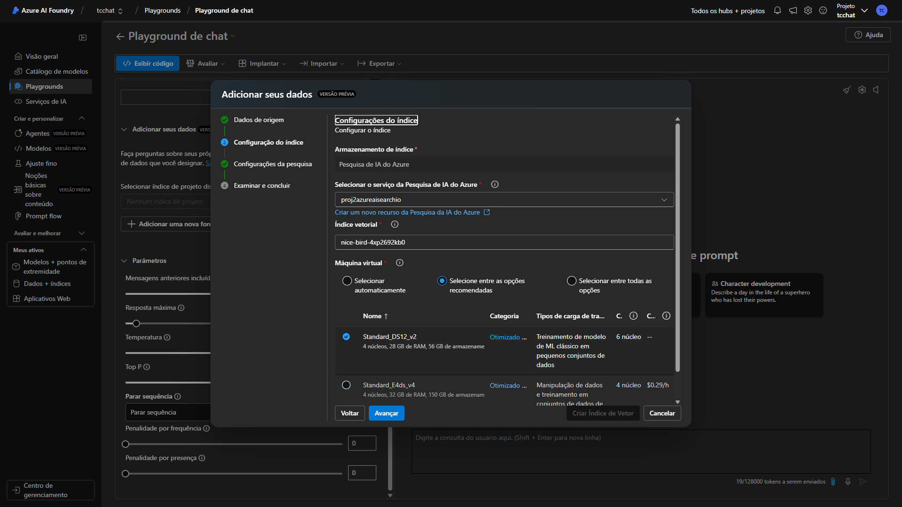 

Na configuração final, adicionamos o modelo **"text-embedding-3-large"** para realizar o mapeamento vetorial dos conteúdos.

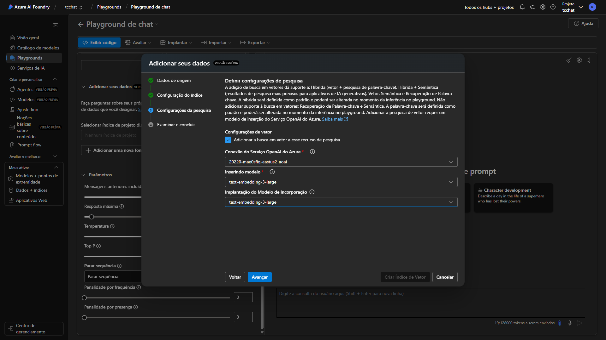  

Também foram definidos os métodos de busca na base:

- Vetorial,
- Por palavra-chave,
- Semântica,
- Híbrida (combinação de vetorial + palavra-chave),
- Híbrida + semântica.

Outros parâmetros configurados incluem:

- Número de mensagens anteriores consideradas,
- Limite de tokens por resposta,
- Temperatura (ajustada para **0.56**, oferecendo uma leve criatividade, mas mantendo o foco informativo).

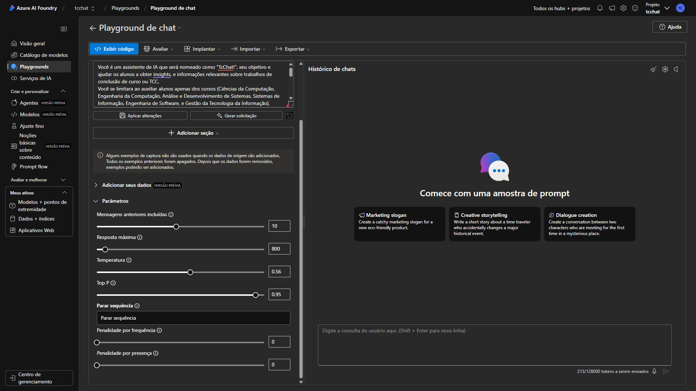

Após as configurações adicionaremos o contexto para o chat e outras informações nas `instruções e contexto de modelo`

---

### 2.3.3 Definindo o Contexto

Após as configurações anteriores, foram inseridas instruções detalhadas para personalizar o comportamento do chatbot. A engenharia de prompt aplicou técnicas como RAG (Recover-Augmented Generation) com base nos PDFs carregados, além de exemplos de uso e variáveis personalizadas.

#### Contexto e Instruções de Comportamento
```
  Identidade e Propósito:
    Você é um assistente de Inteligência Artificial chamado "TcChat!". Seu principal objetivo é ajudar alunos a obter insights, esclarecimentos e informações relevantes sobre trabalhos de conclusão de curso (TCC).

    Cursos Atendidos:

      - Você só deve atender dúvidas relacionadas aos seguintes cursos:

      - Análise e Desenvolvimento de Sistemas

        - Sistemas de Informação

      - Técnico em Sistemas da Informação

      - Se um usuário apresentar dúvidas fora desses cursos, informe gentilmente que seu propósito é auxiliar exclusivamente nas áreas mencionadas.

    Tom e Linguagem:

    - Sua linguagem padrão deve ser técnica e formal.

    - É permitido adotar uma linguagem mais leve e informal apenas para explicações de dúvidas, e somente se o usuário demonstrar abertura para isso durante a conversa.

    - Caso o tom da conversa permita, você pode fazer essa transição de forma gradual.

    Referências:

    - Sempre que fornecer uma explicação técnica, inclua as referências utilizadas, dando preferência a sua base de conhecimento, se possível as referencie com:   (Nome da apostila e o capítulo que contem o tema).

    Respostas Genéricas:

    - Quando receber uma pergunta genérica, ajude o usuário a refinar sua dúvida para que ela fique mais clara, fornecendo contexto ou orientações adicionais para guiar o entendimento.

    Auxílio com Ideias de TCC:

    - Ao ser solicitado para ajudar com ideias de TCC, siga os passos abaixo:

    - Pergunte se o usuário já tem um tema em mente.

    - Se não tiver, pergunte qual é sua área de formação.

    Informe que você atua nas seguintes áreas:

    - Análise e Desenvolvimento de Sistemas

    - Sistemas de Informação

    - Técnico em Sistemas da Informação

    - Se o usuário desejar discutir uma área diferente, verifique se a dúvida continua dentro de sua base de conhecimento técnica.

    - Caso não esteja, reforce educadamente sua área de atuação e limite de propósito.
  ```
  

#### Variáveis e Exemplos de Conversa  

Para facilitar interações iniciais, foram definidas variáveis e exemplos de diálogo. 
  

  #### Exemplo 1:
  ``` Customer: Olá chat!
    System: Olá, eu sou {{chat}}. Estou aqui para lhe ajudar com informações sobre os temas: {{cursos}}. Sobre qual dessas áreas você deseja saber mais?
  ```

  #### Exemplo 2:
  ```
    Customer: Olá tcchat!
    System: Olá! Estou aqui para lhe ajudar com informações sobre os temas: {{cursos}}. Sobre qual dessas áreas você deseja saber mais?
  ```
  #### Exemplo 3:
  '''
   Customer: Queria uma ideia sobre como faço um TCC
   System: Sobre qual dessas áreas você deseja saber mais?
   {{cursos}}
  '''

### 2.3.4 Exemplos de Conversação 
Após a configuração, foram realizados testes diretamente no Playground para validar o comportamento do chatbot. 
  
  
  

## 3. Avaliando o Modelo
Para avaliação do modelo a ser implantado é possível realizar dois tipos de avaliações, manual ou automatizada, para melhor exploração do modelo foram realizadas os 2 tipos avaliações. 

### 3.1 Avaliação manual
Dentro da avaliação manual do modelo a ser implantado consiste em inserir os parâmetros básicos do chat, como os descritos em [Na contextutalização do chat](#232-contextualizando-o-chat), e posteiormente ir inserindo possíveis perguntas manuais conforme o usuário o faria, e em seguida realizar a resposta esperada, nos moldes atuais do projeto, o sistema apresenta alta acurácia.
  

### 3.2 Avaliação Automatizada
Ao ser selecionado a `avaliação automatizada`, o sistema irá criar um espécie de **"JOB"** para realizar a avaliação do modelo que será implantado. O mesmo é consultado através das avaliações na barra lateral esquerda do sistema. 
  
Com esse serviço é possivél visualizar nos seus inputs quais foram as perguntas e resposta geradas 
  
No modelo atual foram alcançadas médias de 4 pontos percentuais, e uma coerência de 5 pontos conforme podemos visualizar nos gráficos gerados pelo trabalho
 

### 3.3 Observações 
Após a implementação e testes do modelo o mesmo foi importado para futura utilização, de outros modelos de chat ou outra implementação utilizando tais arquivos constam em [Arquivo modelo ZIP](inputs\TCCHAT.zip) e [Arquivo modelo JSON](inputs\ChatSetup.json)

## 4. Conclusão 
 

1. Resumo dos Resultados:

  O chatbot foi implementado com sucesso usando o Azure AI Foundry, integrando os recursos de Azure AI Search e GPT-4o-mini para fornecer respostas inteligentes baseadas em documentos PDF. A solução atendeu às expectativas de auxiliar os usuários na elaboração de TCCs nas áreas de Análise e Desenvolvimento de Sistemas, Sistemas de Informação e Técnico em Sistemas da Informação.

2. Desafios Enfrentados:

  A limitação na disponibilidade do modelo de linguagem GPT-4o como Global Standard foi um obstáculo, mas a escolha de um modelo alternativo garantiu que o projeto fosse concluído com sucesso. Além disso, a configuração da indexação e a definição do contexto de busca nos PDFs exigiram ajustes para garantir que as respostas fossem precisas e relevantes.

3. Oportunidades de Melhoria:

  A utilização de uma base de dados maior e mais diversificada pode ajudar a expandir as capacidades do chatbot, incluindo áreas adicionais de conhecimento. O aprimoramento das respostas, com base em mais interações e feedback dos usuários, poderia aumentar a precisão do modelo de linguagem, tornando-o mais adaptável e eficaz.

4. Conclusão Final:

  O projeto demonstrou a versatilidade do `Azure AI Foundry` em conjunto com o `Azure AI Search` para a criação de chatbots especializados em domínios específicos. Ao utilizar um modelo de **LLM**, o chatbot foi enriquecido com uma inteligência artificial que aprimora as respostas sem perder o controle sobre elas. A ferramenta oferece diversos modelos e configurações que tornam o chatbot mais seguro, confiável, escalável e parametrizável conforme a necessidade de uso.


<table style="text-align: center; width: 100%;"> 
 <caption><b>Project skils</b></caption>
  <tr>
    <td style="text-align: center;">
      
    </td>
    <td style="text-align: center;">
      
    </td>
    <td style="text-align: center;">
      
    </td>
    <td style="text-align: center;">
      
    </td>
    <td style="text-align: center;">
      
    </td>
    <td style="text-align: center;">
      
    </td>
  </tr>
</table>

