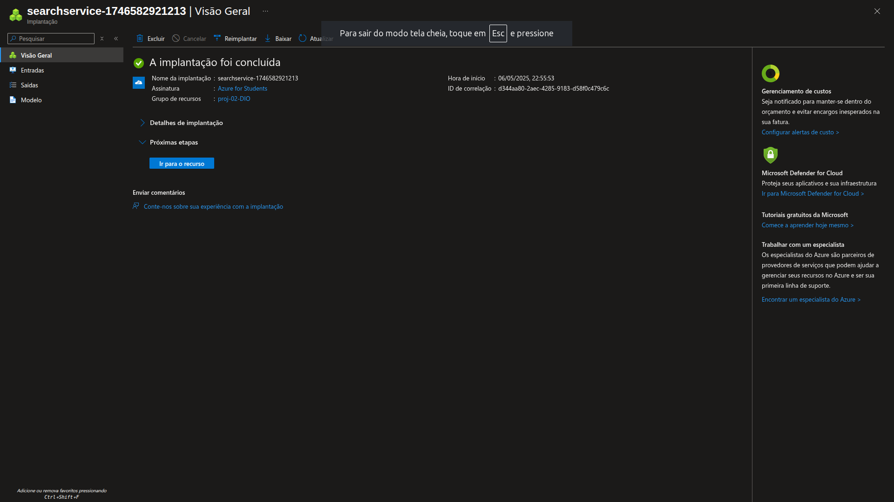

&nbsp;&nbsp;&nbsp;&nbsp;

# Azure Foundry - Chatbot

Chatbot baseado em conteúdos PDFs utilizando o Azure Foundry

O documento a seguir descreve o processo de criação de um chatbot utilizando a plaforma **Azure Foundry**, desde a configuração dos componentes necessários, para aplicação e treinamento do modelo, bem como demonstração de uso e aplicação do modelo na prática. 

## Índice

- [1. Workspace e Recursos](#1-workspace-e-recursos)
  - [1.1 Sobre Recursos utilizados](#11-recursos-utilizados)
  - [1.2 Configuração do Azure AI Search](#12-azure-ai-search)
  - [1.3 Configuração do Azure AI Foundry](#13-azure-ai-foundry)
- [2. Azure AI Foundry Studio](#2-azure-ai-foundry-studio)
  - [2.1 Criando um novo Projeto](#21-criação-do-projeto)
- [Funcionalidades](#funcionalidades)
- [Licença](#licenca)

## 1. Workspace-e-Recursos

**Para o início do projeto, foi criada uma workspace nomeada como `proj-02-dio`:**

Para evitar problemas com "recursos indisponíveis", tanto o workspace quanto os demais recursos foram provisionados com a localidade **Brazil South**.  
Essa escolha tornou o processo um pouco mais lento, porém possibilitou o acesso a uma maior disponibilidade de recursos.  
  

  

---

### 1.1 Recursos-Utilizados

Antes de iniciar a criação do projeto de chatbot que será utilizado posteriormente, é necessário que os recursos complementares estejam devidamente criados e prontos para uso no workspace.  

Além do recurso principal **Azure AI Foundry**, é essencial que o serviço **Azure AI Search** também esteja presente no workspace criado, pois é por meio dele que será possível configurar o modelo utilizado, permitindo que este busque os arquivos fornecidos e os converta em uma base de conhecimento para o agente.  

Sendo assim, foram criados os seguintes recursos:

---

### 1.2 Azure AI Search

Para que o chatbot a ser criado tenha um viés baseado nos documentos fornecidos, é necessário criar o recurso **[Azure AI Search](#azure-ai-search)**. Com este recurso em nosso workspace, será possível realizar o upload de arquivos PDF que servirão como fonte de busca do modelo durante sua configuração.  
  

As seguintes especificações foram utilizadas na criação do recurso:

#### Informações do Serviço Azure AI Search

| **Configurações Básicas**     |                          |                                                                 |
|-------------------------------|--------------------------|-----------------------------------------------------------------|
| **Nome do Serviço**           | **Localização**          | **Tipo de Serviço**                                             |
| `proj-2-azureaisearch-dio`    |  Brazil South             | Básico (15 GB/partição, máx. 3 réplicas, máx. 3 partições, até 9 unidades de pesquisa) |

|                               | **Escala**               |                                                                 |
|-------------------------------|--------------------------|-----------------------------------------------------------------|
| **Unidades de Pesquisa**      | **Custo Estimado por Mês** | **Réplicas e Partições**                                        |
| 2/9                           | US$ 150,29               | 2 réplicas e 1 partição                                         |

  

  

As configurações de rede e marcas do serviço foram mantidas como padrão.  
  

  

Com as configurações devidamente realizadas, o serviço foi criado e integrado ao workspace.  
  

---

### 1.3 Azure AI Foundry

Com o serviço **Azure AI Search** instalado e configurado, foi realizada a implantação do serviço **Azure AI Foundry**.  
  

Ao iniciar a criação do serviço, a plataforma direciona automaticamente para a criação de um **HUB**, responsável por armazenar os projetos que serão desenvolvidos futuramente.

As seguintes especificações foram utilizadas:

#### Informações do Serviço Azure AI Foundry

| **Configurações Básicas**      |            |                 |
|--------------------------------|------------|-----------------|
| **Nome do Serviço**            | **Localização** | **Grupo de Recursos** |
| `proj-2-azureaifoundry-dio`    | Brazil South    | proj-02-DIO     |

  

As demais configurações foram mantidas com os valores padrão.  
  

  

Com os recursos primários devidamente implantados, dá-se início ao processo de criação e treinamento do chatbot.

## 2 Azure AI Foundry Studio
Dentro do ambiente do **Azure AI Foundry**, é apresentada a tela de Overview, na qual são exibidos todos os projetos criados para aquele hub.
  
Nesse menu, é possível não apenas criar um novo projeto para o hub, como também visualizar todos os projetos já existentes. O projeto que será estudado foi nomeado como **"tcchat"**.
  

### 2.1 Criação do projeto
Dentro desse menu de Overview, ao clicar na opção de "Novo Projeto", será apresentada uma tela para nomear o novo projeto a ser desenvolvido.
  
Após a criação, o usuário é direcionado ao centro de gerenciamento do projeto, onde será feita a configuração propriamente dita. Nessa mesma tela, já é possível visualizar, além dos endpoints disponíveis, quais são os recursos conectados ao projeto.

### 2.2 Criando o agente
Para criar um novo agente para o projeto, devemos acessar a opção de "Models + Endpoints" correspondentes ao projeto desejado.
#### Criando um novo modelo 
Dentro da opção "Models + Endpoints", são apresentados todos os modelos já implantados, bem como os pontos de acesso daquele projeto. Também é apresentada a opção de criar um novo modelo, onde é possível selecionar se o novo modelo a ser criado será um modelo básico ou um modelo ajustado.  

    (Para o projeto em questão, será criado apenas um modelo básico.)

  

### 2.3 Configurando o modelo 
Após selecionar o tipo de modelo a ser implantado será apresentado a tela para seleção de modelos de agente disponiveis 
   
    Neste projeto serão utilizados 2 tipos de modelos diferentes sendo eles:
      gpt-4o & 

  

<table style="text-align: center; width: 100%;">
 <caption><b>Project skils</b></caption>
  <tr>
    <td style="text-align: center;">
      
    </td>
    <td style="text-align: center;">
      
    </td>
    <td style="text-align: center;">
      
    </td>
    <td style="text-align: center;">
      
    </td>
    <td style="text-align: center;">
      
    </td>
    <td style="text-align: center;">
      
    </td>
  </tr>
</table>

